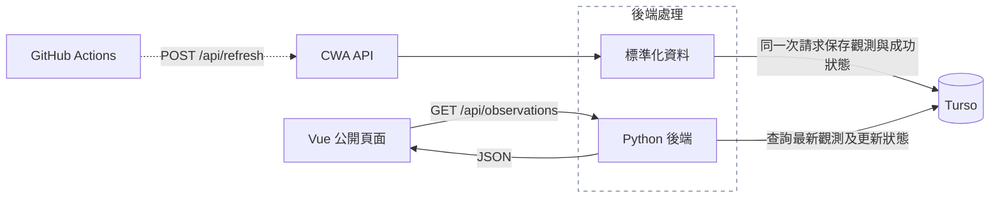

# 臺灣氣象觀測｜CWA × Python × Turso × Vue

使用中央氣象署 `O-A0003-001` 測站觀測資料，完成資料取得、標準化、SQLite／Turso 儲存與 Vue 視覺化。本專案呈現測站的即時觀測快照；氣溫、濕度、氣壓、風速、風向及降雨都可追溯至資料來源。

目前已完成本機前後端與真實 Turso 整合。正式部署目標為 Vercel，部署設定、正式網址及定時更新尚待完成。

## 功能

- 縣市篩選與可搜尋的測站下拉選單。
- 測站地圖支援縮放、拖曳、名稱提示及點選詳情，可切換氣溫／降雨分布。
- 比較圖涵蓋篩選後的全部測站，每頁 8 站，支援氣溫、濕度、風速、累積降雨及高低排序。
- 觀測表格每頁 10 站，預設氣溫降序；數值與觀測時間可升降排序，缺值排在最後。
- 顯示觀測時間、資料擷取時間，以及最近一次更新失敗的公開提示。
- 初次讀取失敗可重試；後續讀取失敗保留上次成功取得的資料。
- 響應式版面；時間以 `Asia/Taipei` 顯示。

## 技術與模組

| 層級 | 使用方式 |
|---|---|
| 資料來源 | CWA `O-A0003-001` JSON API |
| 後端 | Python 3.12、標準函式庫 `http.server`、requests |
| 本機資料庫 | Python 內建 sqlite3，用於 SQL 學習與資料驗證 |
| 網站資料庫 | Turso，透過 libsql 連線 |
| 前端 | Vue 3、Vite、Leaflet、OpenStreetMap 底圖 |
| 部署目標 | Vercel 靜態前端與 Python Functions，尚未正式驗收 |

```text
.
├── api/
│   ├── health.py               # 健康檢查與共用 JSON 回應
│   ├── observations.py         # 公開觀測查詢
│   └── refresh.py              # 受保護的更新入口；本機整合啟動入口
├── fetch_cwa.py                # CWA 請求、驗證、標準化；CLI 寫入本機 SQLite
├── upsert_db.py                # 本機 SQLite UPSERT 與共用 SQL
├── turso_db.py                 # Turso 連線、查詢、交易與更新狀態
├── weather_service.py          # 串接取得、保存、查詢與失敗回退
├── database_schema.sql         # 觀測表與索引
├── refresh_status_schema.sql   # 最近一次更新狀態表
├── requirements.txt           # Python 依賴與固定版本
├── .env.example               # 環境變數名稱，沒有真實憑證
└── frontend/                  # Vue 元件、樣式、Vite 設定及 npm lockfile
```

## 資料流與責任分工



圖中虛線箭頭表示尚待接入的排程流程。已選定 GitHub Actions 每 30 分鐘帶授權呼叫 `POST /api/refresh`，由 Python 後端取得 CWA 資料；圖中省略更新 handler 節點。Actions 只持有管理更新 token，CWA 與 Turso 憑證留在 Vercel 後端。

Vue 透過後端 API 讀取 Turso 的資料。CWA 金鑰、Turso token 與管理更新 token 都由後端使用；瀏覽器不直接連線 CWA 或 Turso。

畫面上的「重新讀取」只呼叫 `GET /api/observations`。只有管理更新成功後，資料庫才會取得新一批 CWA 資料；因此重讀相同內容並不表示前端快取失效。專案目前沒有自動更新排程。

本機 SQLite 是另一條練習流程：`python -m fetch_cwa` 取得並標準化 CWA 資料，再保存至本機 `.db`。本機 SQLite 與 Turso 不會自動同步；網站 API 使用 Turso。

## 本機啟動

以下指令都在 repository 根目錄執行。先安裝 Python 3.12 與 Node.js；本機已驗證 Node.js 24.11.1、npm 11.6.2。Node runtime 可依既有 Volta 設定管理，依賴使用 repository 的 npm lockfile。

### 1. 安裝依賴

```sh
python3.12 -m venv .venv
source .venv/bin/activate
python -m pip install -r requirements.txt
npm --prefix frontend ci
```

Python 使用 requests 2.34.2、python-dotenv 1.2.3、libsql 0.1.11。sqlite3 屬於 Python 標準函式庫，不需另外安裝。

### 2. 設定環境變數

首次設定時，確認根目錄尚無 `.env`，再複製範例：

```sh
cp -n .env.example .env
chmod 600 .env
```

在本機編輯 `.env`，填入自己的設定。不要將真實內容貼進終端輸出、README 或版本控制。

| 名稱 | 用途 |
|---|---|
| `CWA_API_KEY` | 後端呼叫 CWA 所需的授權 |
| `TURSO_DATABASE_URL` | 自己的 Turso 資料庫連線位址 |
| `TURSO_AUTH_TOKEN` | 查詢及更新 Turso 的憑證 |
| `REFRESH_API_TOKEN` | 管理端呼叫 `POST /api/refresh` 的共用授權 |

`load_dotenv(..., override=False)` 會補上程序尚未設定的環境變數。若部署平台已提供同名變數，平台設定優先；本機 `.env` 不會覆蓋它。

不要為這些後端憑證建立 `VITE_` 變數，也不要將它們放入 frontend。

### 3. 準備 Turso 資料表

使用自己的測試資料庫，先確認實際目標，再透過具有建表權限的管理介面依序執行：

1. `database_schema.sql`
2. `refresh_status_schema.sql`

這會建立觀測表、索引及更新狀態表，不會自動匯入本機資料。應用程式啟動時不會自動建立 schema。

應用程式 token 需要對 `weather_observations` 與 `weather_refresh_status` 具備 SELECT／INSERT／UPDATE 權限；正常流程不需要 DELETE 或建表權限。建立 schema 的管理權限與應用程式的資料存取權限應分開。

若已經有 schema，兩份 SQL 使用 `IF NOT EXISTS`，但它不會替既有表修正不同的結構。仍需核對欄位與限制。

### 4. 啟動後端與前端

終端 A：

```sh
source .venv/bin/activate
python -B -m api.refresh
```

此本機入口同時提供 health、observations 與 refresh 路由，監聽 `127.0.0.1:8000`。修改後端程式後需停止並重新啟動，才會載入新版本。

終端 B：

```sh
npm --prefix frontend run dev
```

開啟 Vite 顯示的網址，預設為 `http://127.0.0.1:5173/`。Vite 開發代理會將 `/api` 轉送至 `http://127.0.0.1:8000`。若 5173 已被使用，以 Vite 實際輸出為準。

前端代理可透過非敏感的 `WEATHER_API_TARGET` 指向其他本機 API。預設情況不需設定。

### 5. 先做唯讀確認

```sh
curl --fail http://127.0.0.1:8000/api/health
curl --fail http://127.0.0.1:8000/api/observations
python -B turso_db.py
```

health 預期為 `{"status":"ok"}`。observations 回傳 `data` 與 `meta`；新資料庫尚未更新時，`data` 可為空陣列、`meta.refresh` 可為 null。`turso_db.py` 只查詢總筆數與最新測站筆數。

首次匯入需要執行下一節的管理更新。只讀 API 不會代替你取得 CWA 資料。

### 6. 管理者手動更新

以下範例會向 CWA 取得資料，並寫入 `.env` 所指向的 Turso。執行前先確認資料庫目標、授權與影響範圍。它不會更新本機 SQLite。

在根目錄、已啟用虛擬環境的終端執行：

```sh
python -B - <<'PY'
import os
from pathlib import Path
import requests
from dotenv import load_dotenv

load_dotenv(Path.cwd() / '.env', override=False)
token = os.getenv('REFRESH_API_TOKEN')
if not token:
    raise SystemExit('REFRESH_API_TOKEN: missing')

try:
    response = requests.post(
        'http://127.0.0.1:8000/api/refresh',
        headers={'Authorization': 'Bearer ' + token},
        timeout=60,
    )
    payload = response.json()
except (requests.RequestException, ValueError):
    raise SystemExit('更新請求失敗，請檢查 API 與連線') from None

print('HTTP status:', response.status_code)
print('測站筆數:', payload.get('meta', {}).get('count'))
print('更新狀態:', payload.get('meta', {}).get('refresh'))
print('提示:', payload.get('warning') or payload.get('error'))
PY
```

token 由程序讀取並放入 HTTP header，不以原值作為命令列參數，也不印出。CWA 更新失敗但有既有資料時，API 可能回 200 並附上 warning；判斷更新成功需一併確認 `meta.refresh.status` 為 `succeeded`。

### 7. 前端建置

```sh
npm --prefix frontend run build
```

產物位於 `frontend/dist`。`vite preview` 只預覽靜態產物，沒有這份 Vite 開發代理；完整網站仍需要後端 API 路由。

## 本機 SQLite 練習流程

這條流程可獨立用於學習資料表、複合主鍵與 UPSERT。它不會建立或更新 Turso。

首次建立本機資料庫：

```sh
python -B - <<'PY'
from pathlib import Path
import sqlite3

root = Path.cwd()
with sqlite3.connect(root / 'weather_observations.db') as connection:
    connection.executescript((root / 'database_schema.sql').read_text())
PY
```

取得 CWA 資料並寫入本機 SQLite：

```sh
python -B -m fetch_cwa
```

`upsert_db.py` 會先確認 `.db` 已存在，避免因路徑錯誤悄悄建立另一個空資料庫。本機 `.db` 不納入 Git。

## 資料表與 API

### 觀測表：`weather_observations`

完整定義見 [database_schema.sql](database_schema.sql)。共有 17 個欄位，包含測站、觀測時間、位置、氣象值、特殊狀態及資料擷取時間。

- 複合主鍵為 `(station_id, observed_at)`：同站同時間最多一列。
- UPSERT 遇到相同主鍵更新該列；新觀測時間新增歷史列。
- 查詢先求每站的 `MAX(observed_at)`，再取回完整觀測列。
- `wind_direction_variable` 在 SQLite／Turso 保存為 0／1，API 回傳 bool。
- `observed_at` 是測站觀測時間；`fetched_at` 是後端取得該批資料的時間，兩者不一定相同。

### 更新狀態表：`weather_refresh_status`

完整定義見 [refresh_status_schema.sql](refresh_status_schema.sql)。`id = 1` 保存最近一次更新嘗試，包含嘗試時間、succeeded／failed、上次成功時間與錯誤碼。

成功更新時，觀測 UPSERT 與成功狀態在同一個交易內提交；任何一步失敗都 rollback。CWA 取得失敗時，另行保存失敗狀態，保留上次成功時間及既有觀測資料。

### 路由

| 方法／路徑 | 授權與行為 |
|---|---|
| `GET /api/health` | 公開，確認 handler 可回應；不檢查 CWA 或資料庫健康 |
| `GET /api/observations` | 公開，查詢各站最新資料與最近更新狀態 |
| `GET /api/observations?county_name=南投縣` | 可依縣市篩選 |
| `GET /api/observations?station_id=C2I210` | 可依測站篩選；也可同時指定縣市 |
| `POST /api/refresh` | 需要 `Authorization: Bearer <REFRESH_API_TOKEN>`，更新全部測站 |
| `GET /api/refresh` | 405，`Allow: POST` |

查詢只接受 `county_name`／`station_id`，拒絕未知、重複或空白參數。更新入口不接受 query 或 request body，並拒絕重複授權標頭、重複 Content-Length、非零內容長度及 Transfer-Encoding。

JSON 回應設定 Content-Type、正確的 UTF-8 byte Content-Length 與 `Cache-Control: no-store`。資料庫不可用時回傳 503 與固定錯誤碼，不回傳原始例外或帶憑證的 URL。

## 開發過程遇到的架構問題與解法

### 1. 本機 SQLite 檔案無法承擔網站的持久化資料庫

起初以 `.db` 保存資料，適合本機 SQL 練習；但正式網站的部署與執行環境需要獨立的持久化儲存。[Vercel Functions 的檔案系統](https://vercel.com/docs/functions/runtimes#file-system-support)為唯讀，僅提供 `/tmp` 暫存空間，因此本專案選擇外部 Turso 作為網站資料庫。

保留本機 SQLite 作為練習，API 則透過 libsql 連線 Turso。這裡使用的是遠端資料庫連線，沒有設定本機副本或背景同步；將 SQLite 檔排除 Git 也不會刪除本機資料或清空 Turso。

### 2. 公開頁面重新讀取與外部資料更新需要不同權限

若每次開頁或按按鈕都取得整批 CWA 資料，訪客操作就會觸發外部請求與資料庫寫入，也需要處理更新授權及重複呼叫。

因此拆成公開 GET 與受保護的 POST：Vue 只查詢已保存資料，管理者或預定的每 30 分鐘排程負責更新。這讓同一批資料能由多位訪客共用，並使 CWA／Turso／管理憑證都留在後端。定時更新仍需另外接入，目前不會因公開頁面重新整理而更新 CWA。

### 3. CWA 取得邏輯重複，而且 CLI 與網站寫入目標不同

最初 CLI 與 service 層都有取得資料的工作，容易造成驗證、轉換與錯誤處理不一致。

後來抽出 `fetch_normalized_observations()`，統一取得與標準化，但不寫入資料庫。CLI `main()` 接著寫本機 SQLite；`weather_service.py` 接著寫 Turso。`save_observations_to_sqlite`／`save_observations_to_turso` 的名稱則讓目的地在呼叫處就能辨識。

### 4. 重跑更新會不會增加重複資料？資料與成功狀態能否一致？

單純 INSERT 會在重跑同批資料時遇到重複問題；若觀測資料先提交、成功狀態再提交，兩者還可能不同步。

解法是複合主鍵配合 UPSERT，並將整批觀測與成功狀態放進同一個交易。真實整合測試使用固定快照與固定擷取時間重跑，歷史總筆數不增加，17 個欄位逐欄一致。一般實際重抓相同觀測時，`fetched_at` 仍會更新，因此去重不代表整列永遠不變。

### 5. 更新失敗提示必須跨請求存在

只在 POST 回應中附上失敗訊息，下一位訪客透過 GET 查詢時就看不到；將狀態存在 Python 全域變數，也無法供不同執行個體可靠共用。

因此新增 Turso 狀態表。CWA timeout 時保存 failed／CWA_UNAVAILABLE，保留原資料與上次成功時間。之後任何公開 GET 都會讀到同一狀態，Vue 顯示警告；成功更新後清除錯誤，公開提示也隨之解除。

如果 Turso 本身不可用，連失敗狀態也可能無法保存；目前 API 回 503，前端保留已載入的資料並顯示讀取錯誤。程式目前在 CWAError 路徑寫入 CWA_UNAVAILABLE，沒有保證每個資料庫錯誤都能持久化為 DATABASE_UNAVAILABLE。

### 6. 特殊氣象值會扭曲圖表與統計

CWA 的數值包含一般數字及特殊標記，需要在標準化層保留其語意。程式將一般數值的空值／X／-99 轉成 None；風向 990 轉成缺值並標記風向不定。降雨另處理 T、-98，以及其餘負值與非有限值。

| 降雨輸入 | 本專案保存方式 |
|---|---|
| 非負有限數字 | 原數值，`measured` |
| `T` | 0.0，`trace`；畫面顯示雨跡 |
| `-98` | 0.0，`no_rain_6h`；畫面保留 6h 無雨標記 |
| 其他負值、X、空值、NaN／Infinity | None，`missing` |

實際整合時發現既有歷史資料曾將 -990.0 保存為 measured。已修正新資料的降雨轉換，前端也排除歷史負降雨的數值計算並標示異常；歷史列尚未批次修復，-990 的原始代碼意義仍未確認。這項處理不把未知負值當成有效雨量，也不把缺值換成無雨。

### 7. 程式修改後，正在執行的 API 仍可能是舊版

曾遇到程式已修改，但 port 8000 仍由舊程序監聽；再次啟動會出現 Address already in use，前端代理也繼續拿到舊格式。

處理方式是確認監聽程序、停止原本的開發 server，再以 `python -B -m api.refresh` 重啟。驗證時同時比較直接 API 與 Vite 代理的完整 JSON，確認新狀態欄位及所有資料一致。`-B` 只是不寫入 bytecode cache，不提供自動重載。

## 驗證方式與目前範圍

截至 2026-10-06 已完成以下驗證；這是當時的結果，測站數與資料庫筆數會隨後續更新變動。

| 項目 | 方法與通過依據 |
|---|---|
| 資料追溯 | 三站同批原始 CWA JSON → 標準化 → Turso → API 17 欄逐欄對照，再核對畫面 |
| 去重與交易 | 固定 363 筆快照重跑，雲端歷史總數維持 729，資料與成功狀態一致 |
| 失敗與恢復 | 注入 CWA timeout，使用真實 Turso 保存失敗；重新 GET 仍顯示警告，恢復成功後解除 |
| 兩個資料庫分工 | 上述管理更新期間，本機 SQLite hash 不變 |
| 日常 API | 重啟後直接 port 8000 與 Vite 代理的完整回應相等 |
| 前端互動 | 篩選、排序、分頁、地圖與讀取／空資料／失敗狀態；窄螢幕以瀏覽器模擬 |
| 憑證檢查 | 瀏覽器匯出 47 筆請求、14 份解碼後 Source Map、20 個前端檔案，三種有效憑證零命中；公開查詢標頭無 Authorization／Cookie |

timeout 測試替換的是外部取得行為，驗證的是失敗處理與回退流程，不代表發生真實 CWA 服務中斷。測試腳本與完整驗收證據保存在開發工作紀錄中，尚未整理為 repository 內的自動測試套件。

瀏覽器 Network 列表共 49 筆，HAR 匯出 47 筆，未匯出的兩筆未掃描。上述憑證檢查只涵蓋當次本機載入與目前建置；Git 歷史、正式部署版本及真實手機觸控還需另行驗收。

## 每 30 分鐘自動更新（部署必做）

已選定 GitHub Actions，每 30 分鐘呼叫一次現有 `POST /api/refresh`。目前尚未建立或啟用 workflow，待 Vercel 正式部署與管理更新驗收通過後接入。

[GitHub Actions schedule](https://docs.github.com/en/actions/reference/workflows-and-actions/events-that-trigger-workflows#schedule) 最短支援每 5 分鐘執行一次；本專案採每 30 分鐘一次。排程檔需存在於 repository 的 default branch。為降低整點高負載的影響，可安排在每小時第 17、47 分鐘，例如 `17,47 * * * *`；實際觸發仍可能延遲或遺漏，不保證準點。

GitHub Actions 的管理 token 使用 repository secret，只有後端更新授權需要交給排程；CWA 與 Turso 憑證留在 Vercel。workflow 需核對 HTTP／JSON 與 `meta.refresh.status`，避免將 200 的失敗回退誤認為更新成功，也會保留手動觸發以供驗收。

Public repository 連續 60 天無活動時，GitHub 會自動停用 scheduled workflow，需要留意作業交付後的排程狀態。Public repository 使用 standard runner 免費，private repository 消耗方案內額度，見 [Actions billing](https://docs.github.com/en/billing/concepts/product-billing/github-actions)。

選型原因：Vercel Hobby 的單一 Cron job 最頻繁只能每天一次，無法直接達成每 30 分鐘更新，見 [Vercel 方案限制](https://vercel.com/docs/cron-jobs/usage-and-pricing)。GitHub Actions 可以沿用現有 POST 更新入口。

啟用後，至少核對兩次實際排程觸發、資料與成功狀態，再驗收重新部署後仍正常更新。這些是待實作與驗收項目。

## 已知限制與部署待辦

- 目前沒有自動更新排程；已選定 GitHub Actions 每 30 分鐘一次。啟用前，網站新鮮度取決於最後一次成功執行管理更新。
- 最新查詢為「每站最新一筆」，各站的觀測時間可能不同。摘要使用可用數值的未加權平均，缺值不參與計算。
- 狀態表只保存最近一次結果，沒有完整更新歷程。並行更新的排程互斥、重試退避與頻率限制尚未實作。
- CWA 請求 timeout 為 15 秒，前端 GET timeout 為 20 秒；部署時需確認平台執行時間、連線延遲及 runtime 相容性。
- libsql 含平台相關安裝產物，目前只驗證本機環境；Vercel 的 Python／Linux 建置仍待實際確認。
- Leaflet 底圖需要網路並保留 OpenStreetMap attribution；底圖失敗提示與測站圓點可用，但不提供離線底圖。
- Vercel 部署需要整合 `frontend/dist` 與根目錄 `api/`，核對 build command、output directory、Python 依賴、同站 API 路由，以及 Preview／Production 環境變數。
- 正式部署網址、重新部署後資料持久化與排程授權仍待完成。尚未提供可直接操作的 Vercel 部署設定。
- 本機已排除 `.env*`（保留 `.env.example`）、`.db`、`.venv`、快取、node_modules、dist 與 `.vercel`。忽略規則不會移除過去已提交的秘密；對外推送前還需檢查 Git 歷史。

## 參考

- CWA 資料 API：`https://opendata.cwa.gov.tw/api/v1/rest/datastore/O-A0003-001`
- [Vercel Functions 檔案系統與 runtime](https://vercel.com/docs/functions/runtimes#file-system-support)
- [前端操作、元件與啟動說明](frontend/README.md)
