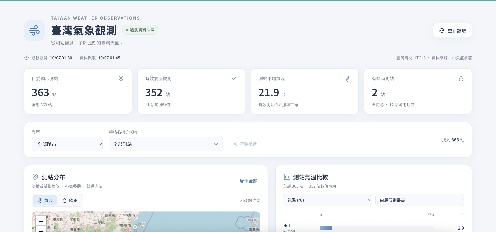
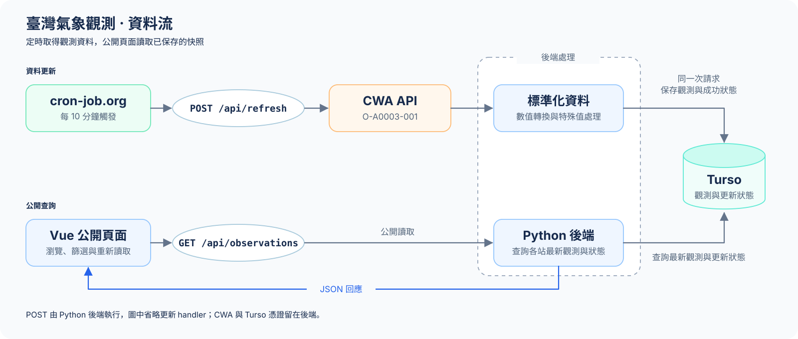

# 臺灣氣象觀測｜CWA × Python × Turso × Vue

使用中央氣象署 `O-A0003-001` 測站觀測資料，完成資料取得、標準化、SQLite／Turso 儲存與 Vue 視覺化。本專案呈現測站的即時觀測快照；氣溫、濕度、氣壓、風速、風向及降雨都可追溯至資料來源。

目前已完成 CWA 資料取得、SQLite／Turso 儲存、Python API、Vue 視覺化及 Vercel 正式部署，具備作業交付與展示所需的核心流程。cron-job.org 每 10 分鐘更新與公開觀測查詢的 60 秒 Vercel CDN 快取已啟用；截至 2026-10-07，公開查詢、真實 CWA 更新、排程簡短回應、資料一致性與重新部署後排程持續運作均已驗收。正式環境的失敗情境、通知實際投遞與實體手機操作仍列為未驗證項目。

**正式網站：[臺灣氣象觀測](https://l3-cw-av2-green.vercel.app/)**



## 功能

- 縣市篩選與可搜尋的測站下拉選單。
- 測站地圖支援縮放、拖曳、名稱提示及點選詳情，可切換氣溫／降雨分布。
- 比較圖涵蓋篩選後的全部測站，每頁 8 站，支援氣溫、濕度、風速、累積降雨及高低排序。
- 觀測表格每頁 10 站，預設氣溫降序；數值與觀測時間可升降排序，缺值排在最後。
- 顯示觀測時間、資料擷取時間，以及最近一次更新失敗的公開提示。
- 初次讀取失敗可重試；後續讀取失敗保留上次成功取得的資料。
- 響應式版面；時間以 `Asia/Taipei` 顯示。
- 公開觀測查詢使用 60 秒 Vercel CDN 快取，減少重複執行 Python 與查詢 Turso。

## 技術與模組

| 層級 | 使用方式 |
|---|---|
| 資料來源 | CWA `O-A0003-001` JSON API |
| 後端 | Python 3.12、標準函式庫 `http.server`、requests |
| 本機資料庫 | Python 內建 sqlite3，用於 SQL 學習與資料驗證 |
| 網站資料庫 | Turso，透過 libsql 連線 |
| 前端 | Vue 3、Vite、Leaflet、OpenStreetMap 底圖 |
| 部署 | Vercel 靜態前端與 Python Functions；公開查詢、更新及重新部署已驗收 |
| 排程 | cron-job.org 每 10 分鐘呼叫受保護的更新 API |
| 快取 | Vercel CDN 保存公開觀測查詢的成功 JSON 回應 60 秒 |

```text
.
├── api/
│   ├── health.py               # 健康檢查與共用 JSON 回應
│   ├── observations.py         # 公開觀測查詢
│   └── refresh.py              # 受保護的更新入口；本機整合啟動入口
├── fetch_cwa.py                # CWA 請求、驗證、標準化；CLI 寫入本機 SQLite
├── upsert_db.py                # 本機 SQLite UPSERT 與共用 SQL
├── turso_db.py                 # Turso 連線、查詢、交易與更新狀態
├── weather_service.py          # 串接取得、保存、查詢與失敗回退
├── database_schema.sql         # 觀測表與索引
├── refresh_status_schema.sql   # 最近一次更新狀態表
├── requirements.txt           # Python 依賴與固定版本
├── .python-version            # Vercel 使用 Python 3.12
├── vercel.json                # 前端建置與 Python Function 設定
├── .env.example               # 環境變數名稱，沒有真實憑證
└── frontend/                  # Vue 元件、樣式、Vite 設定及 npm lockfile
```

## 資料流與責任分工



cron-job.org 已每 10 分鐘帶授權呼叫 `POST /api/refresh`，由 Python 後端取得 CWA 資料；圖中省略更新 handler 節點。排程服務只需持有管理更新 token，CWA 與 Turso 憑證留在 Vercel 後端。

Vue 透過後端 API 讀取 Turso 的資料。CWA 金鑰、Turso token 與管理更新 token 都由後端使用；瀏覽器不直接連線 CWA 或 Turso。

畫面上的「重新讀取」只呼叫 `GET /api/observations`。只有管理更新成功後，資料庫才會取得新一批 CWA 資料；因此重讀相同內容並不表示重新取得過 CWA 資料。公開查詢另使用 60 秒 CDN 快取；按下重新讀取仍可能收到有效的快取快照。原 GitHub 氣象更新 workflow 已移除，cron-job.org 排程已啟用，真實自動更新與重新部署後持續運作均已驗收。

本機 SQLite 是另一條練習流程：`python -m fetch_cwa` 取得並標準化 CWA 資料，再保存至本機 `.db`。本機 SQLite 與 Turso 不會自動同步；網站 API 使用 Turso。

## 本機啟動

以下指令都在 repository 根目錄執行。先安裝 Python 3.12 與 Node.js；本機已驗證 Node.js 24.11.1、npm 11.6.2。Node runtime 可依既有 Volta 設定管理，依賴使用 repository 的 npm lockfile。

### 1. 安裝依賴

```sh
python3.12 -m venv .venv
source .venv/bin/activate
python -m pip install -r requirements.txt
npm --prefix frontend ci
```

Python 使用 requests 2.34.2、python-dotenv 1.2.3、libsql 0.1.11。sqlite3 屬於 Python 標準函式庫，不需另外安裝。

### 2. 設定環境變數

首次設定時，確認根目錄尚無 `.env`，再複製範例：

```sh
cp -n .env.example .env
chmod 600 .env
```

在本機編輯 `.env`，填入自己的設定。不要將真實內容貼進終端輸出、README 或版本控制。

| 名稱 | 用途 |
|---|---|
| `CWA_API_KEY` | 後端呼叫 CWA 所需的授權 |
| `TURSO_DATABASE_URL` | 自己的 Turso 資料庫連線位址 |
| `TURSO_AUTH_TOKEN` | 查詢及更新 Turso 的憑證 |
| `REFRESH_API_TOKEN` | 管理端呼叫 `POST /api/refresh` 的共用授權 |

`load_dotenv(..., override=False)` 會補上程序尚未設定的環境變數。若部署平台已提供同名變數，平台設定優先；本機 `.env` 不會覆蓋它。

不要為這些後端憑證建立 `VITE_` 變數，也不要將它們放入 frontend。

### 3. 準備 Turso 資料表

使用自己的測試資料庫，先確認實際目標，再透過具有建表權限的管理介面依序執行：

1. `database_schema.sql`
2. `refresh_status_schema.sql`

這會建立觀測表、索引及更新狀態表，不會自動匯入本機資料。應用程式啟動時不會自動建立 schema。

應用程式 token 需要對 `weather_observations` 與 `weather_refresh_status` 具備 SELECT／INSERT／UPDATE 權限；正常流程不需要 DELETE 或建表權限。建立 schema 的管理權限與應用程式的資料存取權限應分開。

若已經有 schema，兩份 SQL 使用 `IF NOT EXISTS`，但它不會替既有表修正不同的結構。仍需核對欄位與限制。

### 4. 啟動後端與前端

終端 A：

```sh
source .venv/bin/activate
python -B -m api.refresh
```

此本機入口同時提供 health、observations 與 refresh 路由，監聽 `127.0.0.1:8000`。修改後端程式後需停止並重新啟動，才會載入新版本。

終端 B：

```sh
npm --prefix frontend run dev
```

開啟 Vite 顯示的網址，預設為 `http://127.0.0.1:5173/`。Vite 開發代理會將 `/api` 轉送至 `http://127.0.0.1:8000`。若 5173 已被使用，以 Vite 實際輸出為準。

前端代理可透過非敏感的 `WEATHER_API_TARGET` 指向其他本機 API。預設情況不需設定。

### 5. 先做唯讀確認

```sh
curl --fail http://127.0.0.1:8000/api/health
curl --fail http://127.0.0.1:8000/api/observations
python -B turso_db.py
```

health 預期為 `{"status":"ok"}`。observations 回傳 `data` 與 `meta`；新資料庫尚未更新時，`data` 可為空陣列、`meta.refresh` 可為 null。`turso_db.py` 只查詢總筆數與最新測站筆數。

首次匯入需要執行下一節的管理更新。只讀 API 不會代替你取得 CWA 資料。

### 6. 管理者手動更新

以下範例會向 CWA 取得資料，並寫入 `.env` 所指向的 Turso。執行前先確認資料庫目標、授權與影響範圍。它不會更新本機 SQLite。

在根目錄、已啟用虛擬環境的終端執行：

```sh
python -B - <<'PY'
import os
from pathlib import Path
import requests
from dotenv import load_dotenv

load_dotenv(Path.cwd() / '.env', override=False)
token = os.getenv('REFRESH_API_TOKEN')
if not token:
    raise SystemExit('REFRESH_API_TOKEN: missing')

try:
    response = requests.post(
        'http://127.0.0.1:8000/api/refresh',
        headers={'Authorization': 'Bearer ' + token},
        timeout=60,
    )
    payload = response.json()
except (requests.RequestException, ValueError):
    raise SystemExit('更新請求失敗，請檢查 API 與連線') from None

print('HTTP status:', response.status_code)
print('測站筆數:', payload.get('meta', {}).get('count'))
print('更新狀態:', payload.get('meta', {}).get('refresh'))
print('提示:', payload.get('warning') or payload.get('error'))
PY
```

token 由程序讀取並放入 HTTP header，不以原值作為命令列參數，也不印出。CWA 更新失敗但有既有資料時，API 可能回 200 並附上 warning；判斷更新成功需一併確認 `meta.refresh.status` 為 `succeeded`。

### 7. 前端建置

```sh
npm --prefix frontend run build
```

產物位於 `frontend/dist`。`vite preview` 只預覽靜態產物，沒有這份 Vite 開發代理；完整網站仍需要後端 API 路由。

## 本機 SQLite 練習流程

這條流程可獨立用於學習資料表、複合主鍵與 UPSERT。它不會建立或更新 Turso。

首次建立本機資料庫：

```sh
python -B - <<'PY'
from pathlib import Path
import sqlite3

root = Path.cwd()
with sqlite3.connect(root / 'weather_observations.db') as connection:
    connection.executescript((root / 'database_schema.sql').read_text())
PY
```

取得 CWA 資料並寫入本機 SQLite：

```sh
python -B -m fetch_cwa
```

`upsert_db.py` 會先確認 `.db` 已存在，避免因路徑錯誤悄悄建立另一個空資料庫。本機 `.db` 不納入 Git。

## 資料表與 API

### 觀測表：`weather_observations`

完整定義見 [database_schema.sql](database_schema.sql)。共有 17 個欄位，包含測站、觀測時間、位置、氣象值、特殊狀態及資料擷取時間。

- 複合主鍵為 `(station_id, observed_at)`：同站同時間最多一列。
- UPSERT 遇到相同主鍵更新該列；新觀測時間新增歷史列。
- 查詢先求每站的 `MAX(observed_at)`，再取回完整觀測列。
- `wind_direction_variable` 在 SQLite／Turso 保存為 0／1，API 回傳 bool。
- `observed_at` 是測站觀測時間；`fetched_at` 是後端取得該批資料的時間，兩者不一定相同。

### 更新狀態表：`weather_refresh_status`

完整定義見 [refresh_status_schema.sql](refresh_status_schema.sql)。`id = 1` 保存最近一次更新嘗試，包含嘗試時間、succeeded／failed、上次成功時間與錯誤碼。

成功更新時，觀測 UPSERT 與成功狀態在同一個交易內提交；任何一步失敗都 rollback。CWA 取得失敗時，另行保存失敗狀態，保留上次成功時間及既有觀測資料。

### 路由

| 方法／路徑 | 授權與行為 |
|---|---|
| `GET /api/health` | 公開，確認 handler 可回應；不檢查 CWA 或資料庫健康 |
| `GET /api/observations` | 公開，查詢各站最新資料與最近更新狀態；HTTP 200 使用 60 秒 CDN 快取 |
| `GET /api/observations?county_name=南投縣` | 可依縣市篩選 |
| `GET /api/observations?station_id=C2I210` | 可依測站篩選；也可同時指定縣市 |
| `POST /api/refresh` | 需要 `Authorization: Bearer <REFRESH_API_TOKEN>`，更新全部測站 |
| `GET /api/refresh` | 405，`Allow: POST` |

查詢只接受 `county_name`／`station_id`，拒絕未知、重複或空白參數。更新入口不接受 query 或 request body，並拒絕重複授權標頭、重複 Content-Length、非零內容長度及 Transfer-Encoding。

`POST /api/refresh` 可帶 `Prefer: return=minimal`，成功時回傳 `status`、`processed_count`、`database_count`、`fetched_at` 的簡短 JSON。這個 header 只選擇回應格式，仍需原本的 Bearer 授權，而且不接受 query 或 body。未帶此 header 時沿用完整 `data`／`meta` 回應。

簡短模式的 CWA 失敗會先保存失敗狀態，再回 HTTP 503／`CWA_UNAVAILABLE`；一般完整模式有既有資料時仍可回 HTTP 200 與 warning。公開 GET 維持讀取舊觀測與最近更新狀態。資料庫操作失敗回 HTTP 503／`DATABASE_UNAVAILABLE`。

JSON 回應設定 Content-Type 與正確的 UTF-8 byte Content-Length。共用 `send_json()` 預設使用 `Cache-Control: no-store`；公開觀測查詢的 HTTP 200 回應改用下一節的 CDN 快取設定。資料庫不可用時回傳 503 與固定錯誤碼，不回傳原始例外或帶憑證的 URL。

### 公開查詢的 60 秒 CDN 快取

`GET /api/observations` 的 HTTP 200 回應使用：

```http
Cache-Control: public, max-age=0, must-revalidate
Vercel-CDN-Cache-Control: max-age=60
```

第一個標頭要求瀏覽器重用回應前向伺服器確認；第二個標頭只控制 Vercel CDN，讓有效快取直接回應訪客，省掉當次 Function 執行與 Turso 查詢。Vercel 會消耗第二個標頭，所以正式瀏覽器回應看不到它屬於正常行為，見 [官方快取標頭說明](https://vercel.com/docs/caching/cache-control-headers)。Vue 使用預設 fetch 快取選項，沒有強制指定 no-store。

| 回應 | 設定 |
|---|---|
| 公開觀測查詢 HTTP 200，包含篩選、空資料與既有資料警告 | CDN 有效期 60 秒 |
| health、POST refresh，以及應用程式錯誤回應 | no-store |

有效期由 CDN 建立該快取開始計算，與 observed_at、fetched_at 或 cron 排程時間無關；正常讀取不會延長原本的有效期。到期後由後續請求觸發重新取得。快取按請求 URL／查詢條件區分，且不同 CDN 區域可能各自建立快取。本機 Python server 不提供 Vercel CDN，能檢查標頭，但不能用它證明正式快取命中。

排程 POST 更新 Turso 不會主動清除 GET 的 CDN 快取，因此新觀測、最近失敗提示或恢復成功狀態可能在剩餘 TTL 期間仍顯示上一份快照。這版沒有加入 stale-while-revalidate 或主動清除功能；快取可能提前被驅逐，不保證一定保存完整 60 秒。

## 開發過程遇到的架構問題與解法

### 1. 本機 SQLite 檔案無法承擔網站的持久化資料庫

起初以 `.db` 保存資料，適合本機 SQL 練習；但正式網站的部署與執行環境需要獨立的持久化儲存。[Vercel Functions 的檔案系統](https://vercel.com/docs/functions/runtimes#file-system-support)為唯讀，僅提供 `/tmp` 暫存空間，因此本專案選擇外部 Turso 作為網站資料庫。

保留本機 SQLite 作為練習，API 則透過 libsql 連線 Turso。這裡使用的是遠端資料庫連線，沒有設定本機副本或背景同步；將 SQLite 檔排除 Git 也不會刪除本機資料或清空 Turso。

### 2. 公開頁面重新讀取與外部資料更新需要不同權限

若每次開頁或按按鈕都取得整批 CWA 資料，訪客操作就會觸發外部請求與資料庫寫入，也需要處理更新授權及重複呼叫。

因此拆成公開 GET 與受保護的 POST：Vue 只查詢已保存資料，管理者或已啟用的每 10 分鐘排程負責更新。這讓同一批資料能由多位訪客共用，CWA 與 Turso 憑證留在後端，管理更新 token 只供授權操作端與排程服務使用。定時更新由 cron-job.org 呼叫受保護的 POST；公開頁面重新整理只讀取已保存的資料。

### 3. CWA 取得邏輯重複，而且 CLI 與網站寫入目標不同

最初 CLI 與 service 層都有取得資料的工作，容易造成驗證、轉換與錯誤處理不一致。

後來抽出 `fetch_normalized_observations()`，統一取得與標準化，但不寫入資料庫。CLI `main()` 接著寫本機 SQLite；`weather_service.py` 接著寫 Turso。`save_observations_to_sqlite`／`save_observations_to_turso` 的名稱則讓目的地在呼叫處就能辨識。

### 4. 重跑更新會不會增加重複資料？資料與成功狀態能否一致？

單純 INSERT 會在重跑同批資料時遇到重複問題；若觀測資料先提交、成功狀態再提交，兩者還可能不同步。

解法是複合主鍵配合 UPSERT，並將整批觀測與成功狀態放進同一個交易。真實整合測試使用固定快照與固定擷取時間重跑，歷史總筆數不增加，17 個欄位逐欄一致。一般實際重抓相同觀測時，`fetched_at` 仍會更新，因此去重不代表整列永遠不變。

### 5. 更新失敗提示必須跨請求存在

只在 POST 回應中附上失敗訊息，下一位訪客透過 GET 查詢時就看不到；將狀態存在 Python 全域變數，也無法供不同執行個體可靠共用。

因此新增 Turso 狀態表。CWA timeout 時保存 failed／CWA_UNAVAILABLE，保留原資料與上次成功時間。後續公開 GET 會帶出該狀態，Vue 顯示警告；成功更新後清除錯誤，公開提示也隨之解除。啟用 CDN 快取後，新失敗或恢復狀態可能等到原快取到期才顯示，見公開查詢快取說明。

如果 Turso 本身不可用，連失敗狀態也可能無法保存；目前 API 回 503，前端保留已載入的資料並顯示讀取錯誤。程式目前在 CWAError 路徑寫入 CWA_UNAVAILABLE，沒有保證每個資料庫錯誤都能持久化為 DATABASE_UNAVAILABLE。

### 6. 特殊氣象值會扭曲圖表與統計

CWA 的數值包含一般數字及特殊標記，需要在標準化層保留其語意。程式將一般數值的空值／X／-99 轉成 None；風向 990 轉成缺值並標記風向不定。降雨另處理 T、-98，以及其餘負值與非有限值。

| 降雨輸入 | 本專案保存方式 |
|---|---|
| 非負有限數字 | 原數值，`measured` |
| `T` | 0.0，`trace`；畫面顯示雨跡 |
| `-98` | 0.0，`no_rain_6h`；畫面保留 6h 無雨標記 |
| 其他負值、X、空值、NaN／Infinity | None，`missing` |

實際整合時發現既有歷史資料曾將 -990.0 保存為 measured。已修正新資料的降雨轉換，前端也排除歷史負降雨的數值計算並標示異常；歷史列尚未批次修復，-990 的原始代碼意義仍未確認。這項處理不把未知負值當成有效雨量，也不把缺值換成無雨。

### 7. 程式修改後，正在執行的 API 仍可能是舊版

曾遇到程式已修改，但 port 8000 仍由舊程序監聽；再次啟動會出現 Address already in use，前端代理也繼續拿到舊格式。

處理方式是確認監聽程序、停止原本的開發 server，再以 `python -B -m api.refresh` 重啟。驗證時同時比較直接 API 與 Vite 代理的完整 JSON，確認新狀態欄位及所有資料一致。`-B` 只是不寫入 bytecode cache，不提供自動重載。

### 8. 遠端逐筆寫入遇到 Function 執行時限

首次正式更新在 Vercel 執行 60 秒後回傳 504。原本使用 libsql 0.1.11 的 `executemany`；核對該版本實作後，確認它會逐列等待 SQL 執行完成。對遠端資料庫而言，363 筆資料會累積多次請求等待，即使都放在同一個交易，也不會自動變成一次網路傳輸。

目前改為每 50 列組成一條參數化的多列 UPSERT，363 列只需要 8 次觀測寫入。所有批次與成功狀態仍在同一個交易提交；任一批次失敗就整批 rollback。SQL 沿用共用的欄位與衝突更新規則，不新增依賴。

使用目前專案函式與實際 libsql 驅動，在隔離本機資料庫驗證 17 欄一致、重跑不增加、既有值更新，以及第二批故意失敗後觀測與狀態全部回滾，結果通過。遠端唯讀測試另確認一條 SQL 可綁定 850 個參數。修改後已在正式環境執行一次真實更新：HTTP 200、耗時 8.148 秒，363 站寫入成功，總筆數由 729 增至 1092；公開 GET 與獨立 Turso 查詢的全部資料及 metadata 一致。這次沒有再發生 504，但此耗時包含完整請求，尚未拆分 CWA、資料庫與查詢各階段，也不代表後續每次更新都固定耗時。

### 9. 排程觸發成功與資料更新成功需要分開驗證

最初選用 GitHub Actions 每 30 分鐘更新。手動觸發與真實寫入成功，但排程發布後一段時間沒有任何 schedule 紀錄；2026-10-07 台灣時間 00:02:08 才查到首次 schedule 成功，沒有落在設定的每小時第 17、47 分。執行紀錄未提供原預定時段，所以不能由此精確判定延遲或遺漏次數。[GitHub 官方文件](https://docs.github.com/en/actions/reference/workflows-and-actions/events-that-trigger-workflows#schedule)說明排程在高負載時可能延遲或被丟棄；目前改選 cron-job.org，依其執行紀錄與公開更新狀態驗收。

換服務也需要核對 HTTP 相容性。完整 363 站 JSON 快照約 165 KB，而 [cron-job.org FAQ](https://cron-job.org/en/faq/)列出 64 KB 輸出限制與一般 30 秒逾時。故在既有更新入口加入 `Prefer: return=minimal`，更新成功僅回摘要，同時省去更新後再查詢完整測站的工作。

原本 CWA 失敗但有既有觀測資料時，HTTP 200 代表可提供舊資料，不代表這次更新成功。一般查詢保留這個回退行為；排程的簡短模式改回非 2xx，讓排程服務辨識失敗，公開 GET 仍從資料庫取得失敗警告。新服務的正式簡短回應、至少兩次真實自動更新，以及重新部署後持續更新均已驗收；失敗、恢復與自動停用通知已設定，但通知實際投遞尚未實測。更換服務不等同取得準點或 uptime 保證。

### 10. 公開資料共用快取，但瀏覽器與更新入口需要不同規則

原本所有 JSON 回應都用 no-store，訪客每次讀取都重新執行 Function 並查詢 Turso。觀測快照對訪客相同，又每 10 分鐘才由排程更新，適合在公開 GET 回應前加入短時間共用快取。

共用 send_json 新增僅能以名稱傳入的 cache_control 參數，預設仍為 no-store；只有公開觀測查詢的 HTTP 200 指定瀏覽器重新驗證與 Vercel CDN 60 秒快取。前端移除強制 no-store，保留原有載入、重試及錯誤處理。健康檢查、更新成功及錯誤回應均不套用公開查詢的快取。這個分工減少重複查詢，同時保留明確的資料新鮮度取捨。

## 驗證方式與目前範圍

截至 2026-10-07 已完成以下驗證。各列涵蓋不同測試階段，表中的筆數是當次快照，測站數與歷史總筆數會隨後續更新變動。

| 項目 | 方法與通過依據 |
|---|---|
| 資料追溯 | 三站同批原始 CWA JSON → 標準化 → Turso → API 17 欄逐欄對照，再核對畫面 |
| 去重與交易 | 固定 363 筆快照重跑，雲端歷史總數維持 729，資料與成功狀態一致；隔離測試故意讓第二批 SQL 失敗，確認觀測與狀態全部回滾 |
| 失敗與恢復 | 注入 CWA timeout，使用真實 Turso 保存失敗；重新 GET 仍顯示警告，恢復成功後解除 |
| 兩個資料庫分工 | 上述管理更新期間，本機 SQLite hash 不變 |
| 日常 API | 重啟後直接 port 8000 與 Vite 代理的完整回應相等 |
| 前端互動 | 正式網站驗證篩選、排序、分頁與地圖；目前建置另用模擬 API 驗證載入中、空資料、CWA 失敗提示、已有資料後查詢失敗、初次查詢失敗與成功重試六項情境；窄螢幕以瀏覽器模擬 |
| 真實排程 | 核對 cron-job.org 預定／實際時間、HTTP 200 與簡短摘要，再以匿名 GET、獨立 Turso SELECT 比對全欄位及 metadata；01:25 更新新增 363 個主鍵，原 2544 列逐欄未變 |
| 重新部署 | `b214bb5` 於台灣時間 01:38:46 部署完成；01:45 真實排程成功，原快照 2544 個主鍵全部保留，API／Turso 一致，本機 SQLite 未變 |
| CDN 快取 | 15 項本機隔離情境確認回應標頭；正式匿名 GET 觀察 MISS → HIT、重複內容 hash 相同，等待 TTL 後再次 MISS → HIT；兩個縣市與兩個測站查詢各自命中且資料正確 |
| 憑證檢查 | 瀏覽器匯出 47 筆請求、14 份解碼後 Source Map、20 個前端檔案，三種有效憑證零命中；公開查詢標頭無 Authorization／Cookie |

timeout 測試替換的是外部取得行為，並使用真實 Turso 驗證失敗狀態保存與回退；前端六項錯誤提示測試則使用目前建置與模擬 API，沒有連線 CWA／Turso。兩者都不代表發生真實服務中斷。測試腳本與完整驗收證據保存在開發工作紀錄中，尚未整理為 repository 內的自動測試套件。

瀏覽器 Network 列表共 49 筆，HAR 匯出 47 筆，未匯出的兩筆未掃描。該次 Source Map／HAR 掃描只涵蓋當次本機載入。正式公開 HTML 與直接引用的 JS／CSS 已另行比對當時已知憑證，未命中；2026-10-07 重新部署後，正式 JS／CSS 與本機測試建置的 SHA256 一致。這些結果不涵蓋完整 Git 歷史、未知歷史憑證或真實手機觸控。Vercel 日誌僅抽查約最近 30 分鐘的可見請求列表，未展開完整函式輸出；此範圍未命中現用憑證指紋或原始 CWA JSON 標記。

## Vercel 部署與公開查詢驗收

Vercel Root Directory 使用 repository 根目錄，Framework Preset 為 Vite。vercel.json 指定 npm --prefix frontend ci、npm --prefix frontend run build 與 frontend/dist；Python 版本由 .python-version 固定為 3.12。四個後端環境變數使用 Production 範圍，Preview 的資料庫與更新授權尚未配置。

2026-10-06 從外部以不帶登入 cookie 或授權的 GET 驗收正式網址：首頁、health、全站／單站／縣市查詢正常；無效查詢回傳 400，GET refresh 回傳 405。正式 observations 的 363 站全部欄位與 metadata，與獨立 Turso 唯讀查詢一致，當時 API 使用 Cache-Control: no-store；2026-10-07 起公開觀測查詢的 HTTP 200 已改為 60 秒 CDN 快取，其餘設定見快取章節。

實際瀏覽器驗證縣市 23 站篩選、基隆單站資料、氣溫比較升序、濕度表格降序、兩種分頁、降雨圖層與地圖縮放操作；重新載入後仍可查回 363 站。390 px 手機尺寸檢查為瀏覽器模擬，尚未以真實手機驗收。公開 HTML 及直接引用的 JS／CSS 未命中當次本機已知憑證；此項不涵蓋未知歷史憑證或 Vercel 平台日誌。

正式 POST 更新曾回傳 504，Vercel 日誌確認請求達到設定的 60 秒執行上限；事後唯讀核對仍為 729 筆。改成每 50 列一條多列 UPSERT 後，90618c1 已部署為 Production／Ready；重新部署前後 729 筆歷史資料與狀態逐欄一致。使用者執行一次正式 POST，HTTP 200、耗時 8.148 秒、更新狀態 succeeded，總筆數增至 1092，最新觀測為 2026-10-06T16:20:00+08:00。驗收腳本與後續獨立唯讀核對確認 363 站完整資料／metadata 一致，更新時間前進，本機 SQLite 未變更；cron-job.org 的真實排程觸發亦已另行驗收，見下一節。

2026-10-07 台灣時間 01:38:46，`b214bb5` 已完成新的 Production 部署。01:45 排程在新部署後成功更新，公開首頁與 health 為 HTTP 200；獨立 GET／SELECT 確認 363 站全部欄位與 metadata 一致，歷史總數為當次快照 3633，原 2544 個主鍵全部保留，本機 SQLite 未變。因排程持續更新，持久化判斷以既有主鍵保留為依據，不要求正常 UPSERT 後每個欄位永久不變。

### 60 秒 CDN 快取正式驗收（2026-10-07，台灣時間）

`0ab70cd` 已推送至 GitHub main，Production 部署於 02:30:42 完成。正式首頁引用的 JS／CSS 與本機建置 SHA256 一致。02:42～02:43 使用不帶 Authorization、Cookie 或強制重新驗證標頭的匿名 GET，核對 HTTP 狀態、x-vercel-cache、Age、JSON 與回應內容 hash：

| 情境 | 實際結果 |
|---|---|
| 全站首次／重複查詢 | MISS → HIT，363 站，內容 hash 相同 |
| 南投縣／嘉義市 | 分別回 40／4 站，各自 MISS → HIT，資料皆屬指定縣市 |
| 測站 12J990／12Q970 | 各回 1 站且代碼正確，各自 MISS → HIT |
| health／GET refresh／無效 query | 分別 HTTP 200／405／400，皆 no-store，未命中快取 |
| 最後一次 HIT 後等待 78.64 秒 | 下一次 MISS、Age 0，緊接著 HIT，兩次內容一致 |

這次全站 MISS／HIT 的 requests.elapsed 分別為 3.263／0.092 秒；到期後為 2.368／0.098 秒。該數值量測請求到收到回應標頭的時間，不是完整下載時間；單次結果不代表長期延遲或固定加速倍數。到期後 JSON 仍可相同，因為重新查詢不代表資料庫一定產生新觀測。

這次確認指定 TTL、命中及超過 TTL 後重新取得的行為，沒有量測恰好第 60 秒的邊界。快取可能提早被驅逐，實測範圍為單一請求位置，沒有保證全球每個區域的狀態相同。正式驗收僅發 GET，沒有送 POST、讀取 .env 或直接連線資料庫；POST 成功／失敗及資料庫 503 的不快取標頭由隔離測試驗證。

## 每 10 分鐘自動更新（部署必做）

目前使用 cron-job.org。2026-10-07 的 `841010a` 已部署至 Vercel Production，GitHub repository 已移除 `.github/workflows/weather-refresh.yml`，原 workflow 狀態為 `deleted`。cron-job.org 已啟用每 10 分鐘更新，真實排程、簡短回應與重新部署後排程持續運作驗收通過。GitHub repository 的氣象更新 secret 已由使用者移除，唯讀核對確認 repository 無 secrets；本機、Vercel 與 cron-job.org 繼續使用既有更新 token。移除的是 GitHub 儲存的副本，並未撤銷該 token。

### 建立排程的設定

| 設定 | 值 |
|---|---|
| URL | `https://l3-cw-av2-green.vercel.app/api/refresh` |
| HTTP method | `POST` |
| Request body | 空白 |
| 自訂 header | `Authorization: Bearer <REFRESH_API_TOKEN>`，由使用者直接填入既有值 |
| 自訂 header | `Prefer: return=minimal` |
| 時區 | `Asia/Taipei` |
| 排程 | `5,15,25,35,45,55 * * * *`，每天 144 次 |
| 通知 | 更新失敗、失敗後恢復成功、工作自動停用 |
| 逾時 | 30 秒 |
| 儲存回應 | 已開啟，可從歷史紀錄核對簡短 JSON |
| 目前狀態 | 已啟用，真實自動更新與重新部署後持續運作驗收通過 |

實際設定為每小時第 5、15、25、35、45、55 分，屬於本專案設定，不是來源資料發布時間或準點保證。更新同一觀測主鍵使用 UPSERT，歷史筆數不會因此重複增加，但 fetched_at 仍會變動。CWA／Turso 憑證只留在後端，不交給排程服務。

[cron-job.org 官方 FAQ](https://cron-job.org/en/faq/)支援免費、最短每分鐘執行與自訂 HTTP 請求；一般逾時與回應大小列為 30 秒及 64 KB，建立時另核對帳號實際限制。歷史紀錄與失敗通知有助追查，但官方不保證準時；連續多次失敗可能自動停用，需開啟通知並處理根因。

選型原因：Vercel Hobby 的單一 Cron job 最頻繁只能每天一次，無法直接達成每 10 分鐘更新，見 [Vercel 方案限制](https://vercel.com/docs/cron-jobs/usage-and-pricing)。cron-job.org 能沿用現有 POST 更新入口，並以簡短回應與 HTTP 狀態碼辨識更新結果。

### 驗收與切換

以下為新環境建議的接入順序；本次實際驗收結果另列如下。

1. 完成後端簡短模式的隔離驗證，再部署新版本。
2. 確認原 GitHub workflow 已停用且沒有執行中工作，新 cron 工作仍維持停用。
3. 核對目的 URL、method、授權、空 body、逾時與通知，再執行一次受控真實更新。
4. 確認 HTTP 200、摘要 succeeded、測站處理數與正式 GET／Turso 一致後，才啟用排程。
5. 至少核對兩次真實自動執行的 provider 紀錄、更新成功時間及觀測資料，再驗收重新部署後仍有效。
6. 完整切換後清除 GitHub repository 的氣象更新 secret。本機與 Vercel 繼續使用既有更新 token。

原 Actions 的成功驗收保留為歷史：2026-10-06 手動 run #1 更新耗時 8.659 秒、363 站，Turso 1092 → 1455；獨立唯讀核對 API／Turso 一致、原歷史列與本機 SQLite 未變。2026-10-07 首次 schedule run 成功，公開 last_success 時間落在該 run 期間；這些結果不能代替 cron-job.org 的正式驗收。

### cron-job.org 真實驗收結果（2026-10-07，台灣時間）

| 預定 | 實際開始 | 開始延遲 | 請求耗時 | 結果 |
|---|---|---|---|---|
| 01:15:00 | 01:15:22 | 22.12 秒 | 7.72 秒 | 200 OK |
| 01:25:00 | 01:25:15 | 15.70 秒 | 8.51 秒 | 200 OK、succeeded |
| 01:35:00 | 01:35:16 | 16.83 秒 | 8.77 秒 | 200 OK |
| 01:45:00 | 01:45:22 | 22.29 秒 | 8.53 秒 | 新部署後 200 OK、succeeded |

第二次 provider 保存的 JSON 為 114 bytes，回應為 succeeded、processed_count 363、database_count 2907，fetched_at 為 2026-10-06T17:25:18+00:00（台灣 01:25:18）。獨立匿名 GET 與 Turso 唯讀查詢確認 363 站全欄位及 metadata 一致，最新觀測由 01:00 前進至 01:10、成功時間為 01:25:23.103061，位於該次執行期間。

與第一次更新後的完整快照比對，總筆數 2544 → 2907，新增 363 個主鍵，新增列的 fetched_at 均屬第二次擷取；原 2544 筆逐欄未變，本機 SQLite hash 未變。第一次執行未保存回應本體，因此僅驗收 HTTP 與更新後資料；第二次補齊真實簡短回應。01:45 的 provider 回應同為 114 bytes，摘要為 succeeded、processed_count 363、database_count 3633；fetched_at 為台灣 01:45:24。公開更新成功時間為 01:45:29.587544，晚於 01:38:46 的部署完成時間，且位於該次排程執行期間，最新觀測前進至 01:30。這確認重新部署後排程仍能呼叫正式 API 並保存資料。

以上為成功自動觸發與重新部署後持續運作的證據，不代表長期準點保證或正式失敗通知已實測。驗收核對只使用 GET／SELECT，未額外送 POST。

## 已知限制與後續驗證

- cron-job.org 每 10 分鐘排程已啟用，真實自動執行與重新部署後持續運作通過；GitHub 氣象 workflow 已移除。網站新鮮度取決於最後一次成功更新，排程觸發不保證準點或成功。
- 公開觀測 JSON 使用 60 秒 CDN 快取，觀測及更新狀態可能延後顯示；POST 不主動清除快取。快取驗收只涵蓋單一請求位置，沒有測量全球各區命中率或真實 Turso 查詢次數。
- 最新查詢為「每站最新一筆」，各站的觀測時間可能不同。摘要使用可用數值的未加權平均，缺值不參與計算。
- 狀態表只保存最近一次結果，沒有完整更新歷程。API 尚未提供跨執行個體的更新鎖；舊 Actions concurrency 群組不適用於外部排程服務。API 頻率限制與重試退避尚未實作；排程服務 timeout 不代表後端一定停止或資料未提交，應先查詢更新狀態再決定是否重跑。
- CWA 請求 timeout 為 15 秒，前端 GET timeout 為 20 秒；部署時需確認平台執行時間、連線延遲及 runtime 相容性。
- libsql 含平台相關安裝產物；目前部署的遠端讀取與每批 50 列 UPSERT 寫入均已真實驗收。早期兩次成功更新的完整回應請求耗時為 8.148 與 8.659 秒；cron-job.org 簡短回應的已核對請求耗時為 7.72～8.77 秒。這些是單次量測，尚未測試不同批次大小或長期延遲。
- Leaflet 底圖需要網路並保留 OpenStreetMap attribution；底圖失敗提示與測站圓點可用，但不提供離線底圖。
- Vercel 已整合 frontend/dist 與根目錄 api/，建置設定與公開路由已核對。Production 環境變數已由使用者設定；Preview 範圍未配置。
- 正式網址、完整及簡短回應更新、真實每 10 分鐘自動執行、重新部署持久化與部署後排程已驗收。尚未驗證的是正式環境的授權拒絕路徑、實際 CWA／Turso 失敗時的端到端提示、通知實際投遞、實體手機與完整函式日誌；本機隔離或模擬驗證不等同正式失敗實測。
- 本機已排除 `.env*`（保留 `.env.example`）、`.db`、`.venv`、快取、node_modules、dist 與 `.vercel`。忽略規則不會移除過去已提交的秘密；對外推送前還需檢查 Git 歷史。

## 參考

- CWA 資料 API：`https://opendata.cwa.gov.tw/api/v1/rest/datastore/O-A0003-001`
- [Vercel Functions 檔案系統與 runtime](https://vercel.com/docs/functions/runtimes#file-system-support)
- [前端操作、元件與啟動說明](frontend/README.md)
